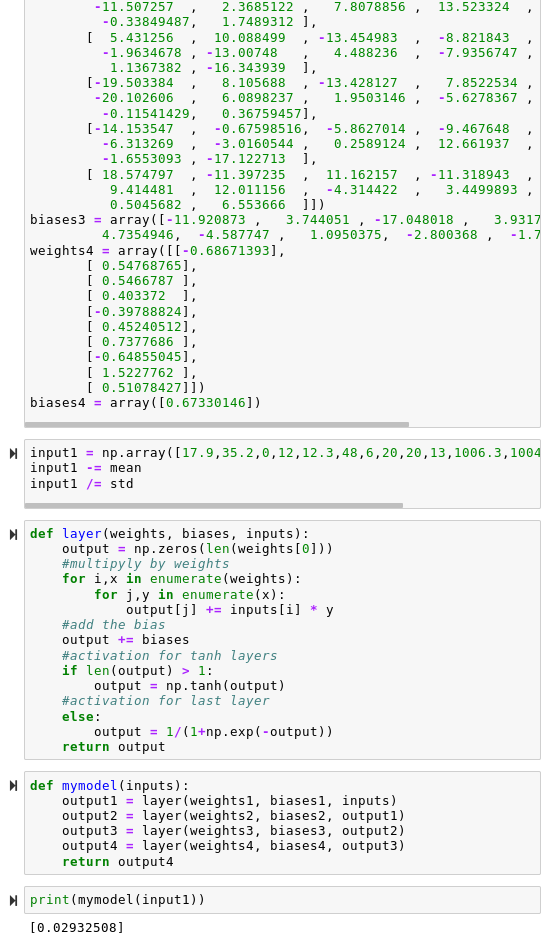

# Rain Predictor

**Dataset:**

Rainfall in australia

https://www.kaggle.com/jsphyg/weather-dataset-rattle-package

**Output:**

probability of rainfall tomorrow

**Activation functions:**

All but the last layer use hyberbolic tangent activation function.

Tanh is good because some inputs may produce opposite effects when numbers go up or down, so output range of -1 to 1 can take advantage of that. 

The output uses sigmoid because the output is yes/no, so it needs a function that goes from 0 to 1

**Data cleaning:**

There were a ton of null values in the data, so I used SQL to make a new file and cut out all the rows that were causing trouble. The program I used is available at davosaur.com/csv and this query will return the same rows:
```
select from /home/dave/sync/classes/artificiali/h/aiproject/weatherAUS.csv
where not (
3=null or 4=null or 5=null or 6=null or 7=null or 9=null or 12=null or 13=null or 14=null or 15=null or 16=null or 17=null or 18=null or 19=null or 20=null or 21=null)
```
**Input features:**

Here are histograms of how frequently each input feature value corresponds to rain or no rain. Blue is rain tomorrow, Orange is no rain tomorrow. The x-axis is feature value, y-axis is frequency of that value and is normalized between the two outcomes for easy comparison.

<br>

<hr>

**My model function:** 

There are too many parameters to hardcode into the function, so it loops over the arrays extracted from keras.

<br>

<hr>

**Main model performance:**

Left is keras model prediction, center is actual rainfall tomorrow, right is my function's prediction

<br>

<hr>

**Model with linear activation:**

<br>

<hr>

**Model with simple linear regression:**

<br>

<hr>
                             
**MOdel with simple logistic regression:**

<br>

