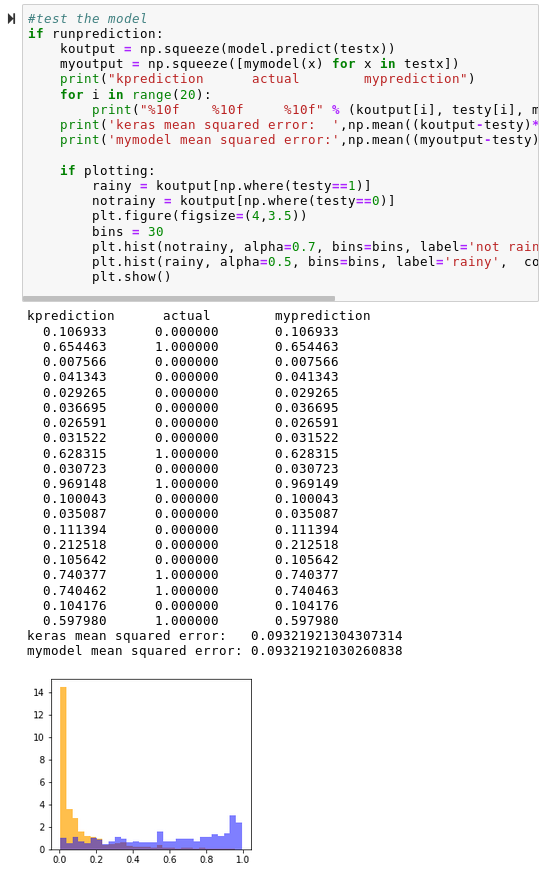

# Rain Predictor

**Dataset:**

Rainfall in australia

https://www.kaggle.com/jsphyg/weather-dataset-rattle-package

**Output:**

probability of rainfall tomorrow

**Activation functions:**

All but the last layer use hyberbolic tangent activation function.

Tanh is good because some inputs may produce opposite effects when numbers go up or down, so output range of -1 to 1 can take advantage of that. 

The last layer uses sigmoid because that output is yes/no, so it needs a function that goes from 0 to 1

**Data cleaning:**

There were a ton of null values in the data, so I used SQL to make a new file (weatherCleaned4.csv) and cut out all the rows that were causing trouble. The program I used is available at davosaur.com/csv and this query will return the same rows:
```
select from /home/dave/sync/classes/artificiali/h/aiproject/weatherAUS.csv
where not (
3=null or 4=null or 5=null or 6=null or 7=null or 9=null or 12=null or 13=null or 14=null or 15=null or 16=null or 17=null or 18=null or 19=null or 20=null or 21=null)
```
**Input features:**

Here are histograms of how frequently each input feature value corresponds to rain or no rain. Blue is rain tomorrow, Orange is no rain tomorrow. The x-axis is feature value, y-axis is frequency of that value and is normalized between the two outcomes for easy comparison. 7 features have very obvious correlations with the output, but the model does best when using all the features and not just the obvious ones.

<br>

<hr>

**My model function:** 

There are too many parameters to hardcode into the function, so it loops over the arrays extracted from keras. The arrays are produced by running weather.py with printweights=True, and then editing the output a bit. This is in mymodel.py and mymodel.ipynb. input1 is one sample row from the input file. It produces the same output as the keras model it is based on.

<br>

<hr>

**Main model performance:**

Left is keras model prediction, center is actual rainfall tomorrow, right is my function's prediction. It can tell you with good certainty that it will not rain, but it is harder to be right about positive predictions. This is expected, since no clouds means no rain, but having clouds doesn't always mean it rains.

<br>

<br>

This is the result when limiting the input features to what look like the most relevant ones. It gets very high confidence on some positive hits, but does very poorly for most predictions, which apperently need the less-obvious data points to increase accuracy.

<br>


<hr>

**Nueral network with linear activation:**

This produces normal-distribution predictions. High accuracy is achieved by separating the orange from the blue, and this distribution makes that much more difficult than the J-shape distributions produced by the tanh-sigmoid model. I kept my hardcoded model on the right for comparision.

<br>

<hr>

**Model with simple linear regression:**

The linear regression model gets almost the same results as the 4-layer neural network with linear activation.

<br>

<hr>
                             
**Model with simple logistic regression:**

This gets a similar type of output as the main model, but with far less accuracy, especially on rain-positive predictions. I tried training it some more, but it never improved beyond this outcome.

<br>

<hr>

Keras model:

https://colab.research.google.com/drive/1qUAs8rP3HGg76wUXv-_PTUWukr9JzbFa#scrollTo=I4z1jc9OU1Ab

My hardcoded model:

https://colab.research.google.com/drive/17W1672j8tua65wXRZLHxona0XQ4TGVjk#scrollTo=OhhBMI6MZQwS
